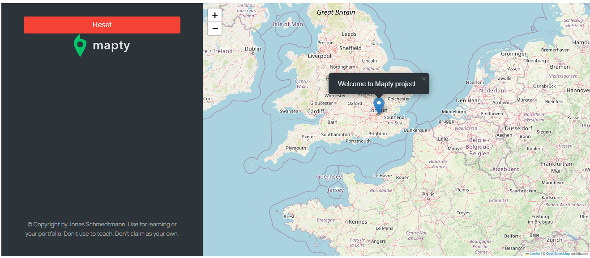
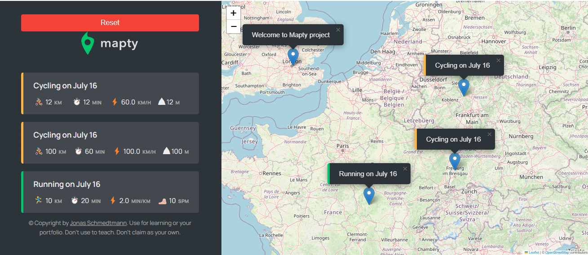

# Mapty App

The Mapty App is a simple application that allows users to record their running or cycling workouts using an interactive map. It utilizes the Leaflet library to render the map and provides a user-friendly interface for entering workout data.

## Screenshots

## Features

- Interactive map powered by Leaflet library
- Record running or cycling workouts
- Store workout data locally using LocalStorage
- Display workout information as popups on the map
- Reset the local Storage

## Installation

1. Clone the repository: `git clone https://github.com/MohamedAboElnaser/mapty-app.git`
2. Navigate to the project directory
3. Open `index.html` in your preferred web browser.

## Usage

1. Upon opening the app, you will see a map rendered using Leaflet.
2. Click on the desired location on the map where you performed your workout.
3. A form will appear, allowing you to enter the workout details such as distance, duration, and type (running or cycling).
4. Press the Enter key or click the submit button to save the workout.
5. The workout will be displayed as a popup on the map, showing the details you entered.

## Live Demo
    click the [link](https://)

## License

The Mapty App is Part of   [Jonas's](https://github.com/jonasschmedtmann/complete-javascript-course) Js course.

